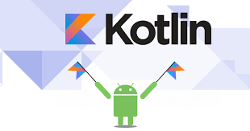

<figure>
    
    <figcaption>android with kotlin</figcaption>
</figure>

## 코틀린은..

[2017 구글 I/O][2017-google-io-url]에서 정식으로 **안드로이드 개발 언어**로 추가되었습니다.  

JVM 위에서 동작하며 **자바와 100% 호환**됩니다.  

자바의 수많은 라이브러리를 그대로 사용하면서 코드는 **더 간결**하게 작성할 수 있습니다. 즉 같은 기능을 구현하더라도 자바에 비해서 더 적은 코드를 작성할 수 있습니다.  

[2018 구글 I/O][2018-google-io-url]에서 대부분의 예제를 **코틀린으로 설명**하고 있습니다.

## 특징

1. 간결한 코드

> 상용구 코드양을 대폭 줄여줍니다.  
예를 들어, 자바에서는 단순한 클래스를 작성할 때 게터 및 세터를 잔뜩 만들고 equals(), hashcode(), toString()을 재정의해 수십 줄의 코드를 작성하게 되지만, 코틀린에서는 한 줄이면 됩니다.

2.  안정성

> Null 포인터 예외와 같은 오류를 피할 수 있습니다.

3. 상호 운용성

> 기존 자바 라이브러리와 100% 호환됩니다.

4. 도구 친화적

> 자바, 안드로이드 개발 도구에서 그대로 사용 가능합니다.

**기존 자바 개발자가 쉽게 배울 수 있습니다.**

## 레퍼런스

오준석의 안드로이드 생존코딩 코틀린 편 ( 오준석 저 / 한빛미디어 / 2018.10.01 )

[2017-google-io-url]: https://events.google.com/io2017/
[2018-google-io-url]: https://events.google.com/io2018/