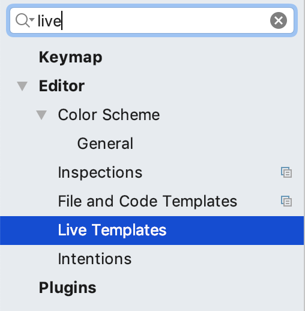
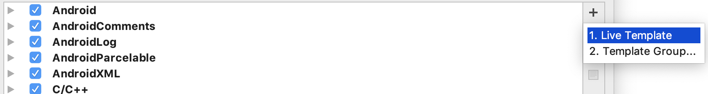
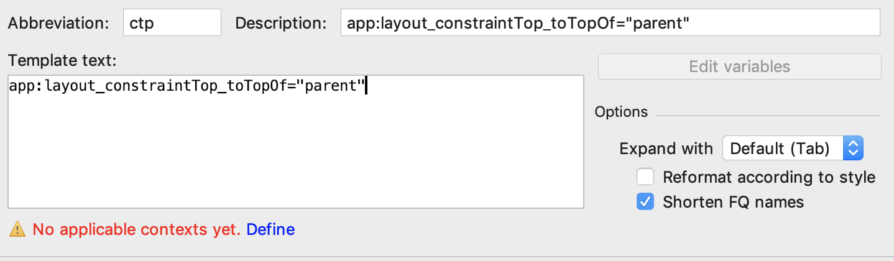
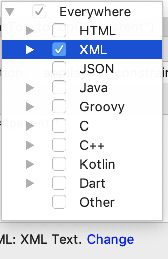
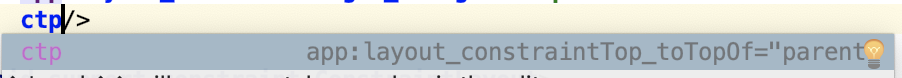

## Live Templates

안드로이드 스튜디오에서 제공하는 Live Templates 기능은 잘만 사용한다면 눈에 띄게 개발 속도를 향상시켜주고 개발 환경의 질이 향상될 수 있습니다.  
이 Live Templates 기능은 안드로이드 스튜디오에만 있는 것은 아니고 대부분의 IDE에서 제공한다고 합니다.  
저는 최근에야 이 기능을 알게되었..  

Live Templates는 사용자가 지정한 키워드를 통해 어떠한 코드 구문을 생성하는 것을 의미합니다.  

안드로이드 개발을 하면서 가장 귀찮았던 것 중 하나가 findViewById였으나, 코틀린을 쓰게 되면서 이 수고는 덜었습니다.  
하지만, ConstraintLayout이 나오면서 제약을 걸어주는 것에 귀찮음이 많았습니다.  
이제 Live Templates를 활용하여서 이런 수고를 덜 수 있도록 해보겠습니다!!  
## TODO

맥 기준으로, 안드로이드 스튜디오 좌측 상단을 클릭하여서 Preferences(Command + ,)에 들어갑니다.  

Preferences창이 뜨면 검색창에 live를 검색해줍니다.  
그러면 다음 그림과 같이 Live Templates가 나타납니다.  

이제 우리는 키워드를 추가해줄것이기 때문에 우측에 있는 + 버튼을 눌러서 Live Template를 눌러줍니다.  

이제 abbreviation에 키워드를 적어줍니다.  
Description과 Template text도 알맞게 작성해줍니다.  
그리고 하단에 있는 Define을 눌러줍니다.  

우리가 만들어줄 키워드는 xml에서 쓰일것이기 때문에 xml에 체크해줍니다.  

이제 xml파일로 돌아와서 작성해준 키워드를 입력하면 자동완성이 될 수 있도록 나오는 것을 확인할 수 있습니다.  

이제 응용하여서 다른 키워드들도 만들어서 좀 더 편리하게 개발을 할 수 있습니다. :smile:

xml에서 말고 코틀린이나 자바에서도 당연히 사용가능 합니다.  
코드에서는 여러 변수가 들어갈 수 있는데, 이런 것들을 사용할 때는 젯브레인에서 제공하는 [문서][ref-url-1]를 참고하시면 될 것 같습니다.  

감사합니다.

## 레퍼런스

[https://family-gram.tistory.com/293][ref-url-2]

[ref-url-1]: "https://www.jetbrains.com/help/idea/template-variables.html"
[ref-url-2]: "https://family-gram.tistory.com/293"