[저번 포스팅][last-posting]에서 React Native에 대해서 알아보았습니다.  
이제 React Native 개발환경셋팅을 해보도록 하겠습니다.  
기본적인 제 노트북 환경은 다음과 같습니다.  
> macOS Mojave 10.14.3
2.3 GHz Intel core i5
8GB 2133 MHz LPDDR3
Macintosh HD
intel Iris Plus Graphics 640 1536 MB

## Getting Started

[React Native 공식 문서][docs-url]에 들어가서 하라는대로 해보도록 하겠습니다.  

웹 개발자의 경우에는 Xcode나 Android Studio 설치를 따로 하지 않고 Expo라는 도구를 사용하는 것이 가장 빠른 방법이라고 합니다.  
Expo CLI로 개발 환경을 구축하고 바로 React Native 앱을 만들 수 있다고 합니다. 그리고 Snack이라는 사이트에서 바로 개발을 진행할 수도 있다고 합니다.  

저는 네이티브 개발자이기 때문에 위에서 안내하는 것은 무시하고 가려했지만.. 팀 프로젝트를 위해 React Native를 배우는 입장이니만큼 위와 같은 방법으로 셋팅하도록 하겠습니다.  

### Node 10+

문서에서 Node 버전이 10 이상일 때를 가정한다는 말이 있어서, 노트북에 깔린 Node의 버전을 확인해야합니다.  
터미널 창을 열어서 다음과 같은 명령어로 Node 버전을 확인합니다.  
~~~
node -v
~~~

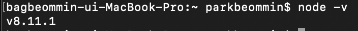

저는 지금 8.11.1 버전이네요.  
업데이트를 해야합니다.  
터미널 창에서 다음과 같은 명령어를 입력합니다.  
~~~
sudo npm cache clean -f
sudo npm install -g n
sudo n stable
node -v
~~~

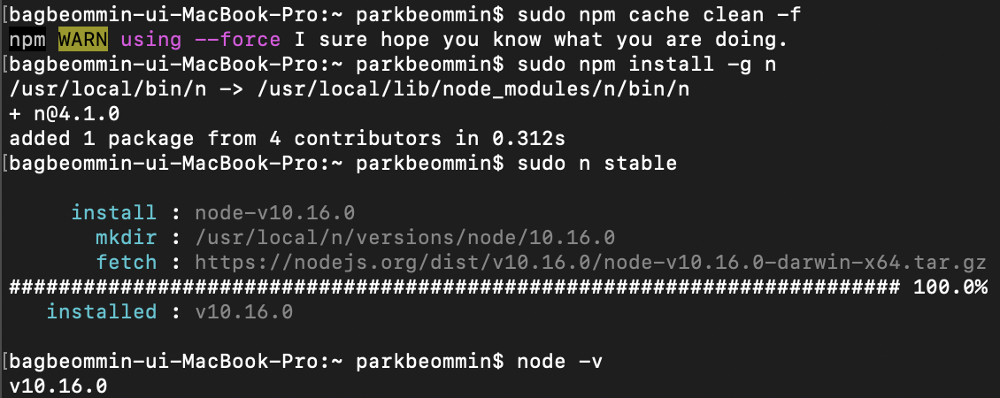

이제 Node 버전이 10.16.0이 되었습니다.  
React Native 환경 설정을 다시 진행해보도록 하겠습니다.  

### Expo CLI 설치

이제 React Native 개발을 위한 Expo CLI를 설치합니다.  
아직 Expo Tool이란게 뭔지는 잘 모르겠지만, React Native 개발을 위해 필요한 것임은 틀림없습니다.  
터미널 창에서 다음과 같이 입력하여 Expo CLI를 설치합니다.
~~~
sudo npm install -g expo-cli
~~~

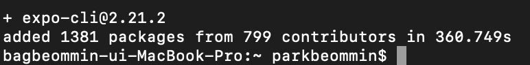

설치가 완료되었습니다. 생각보다 시간이 좀 걸렸네요..  

### Project 생성하고 실행하기

React Native 프로젝트를 폴더와 함께 생성해보도록 하겠습니다.  
Expo CLI가 설치되었으니 Expo 명령어로 생성합니다.  
문서에서 AwesomeProject란 이름의 프로젝트를 생성해보라고 하네요.  
~~~
expo init AwesomeProject
cd AwesomeProject
npm start # you can also use: expo start
~~~

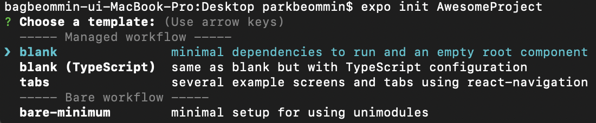

템플릿을 선택하라고 하네요.  
뭔지는 잘 모르겠지만, 실행하는데 최소한의 디펜던시만 갖고 루트 컴포넌트가 비어있는 blank로 선택을 했습니다.  

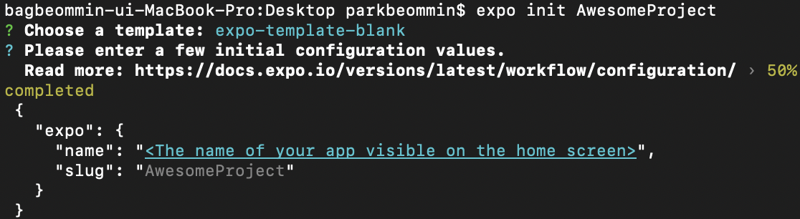

초기 구성 정보를 설정하고 엔터를 눌러달라고 합니다.  
처음에 Please enter만 보고 엔터키를 계속 눌렀는데 안넘어가길래 뭔가 싶었습니다...  

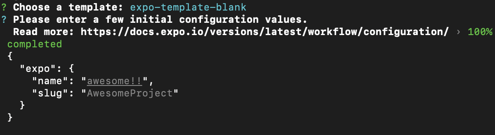

"name" 부분에 값을 넣어달라는 것이었습니다..  
그냥 타이핑하시고 엔터를 누르면 진행이 됩니다.  

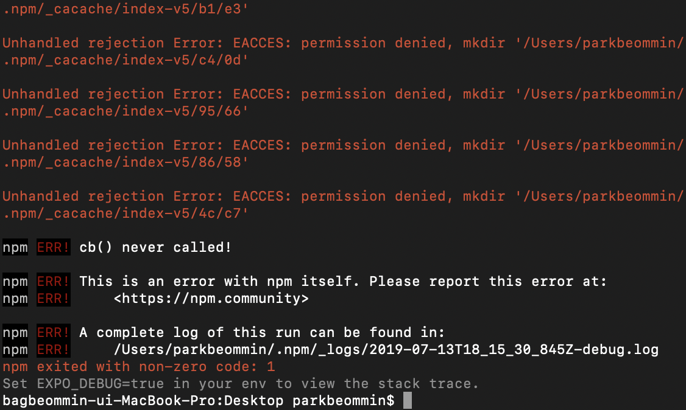

그러더니 갑자기 막 에러메시지가 뜹니다..  
무슨 폴더를 만들어야하는데 퍼미션때문에 거절당해 생긴 에러같습니다..  
혹시나 해서 보니 프로젝트는 생성이 되어있었습니다.  
그래서 프로젝트 폴더로 이동하여 그냥 한 번 실행을 해봤습니다.  

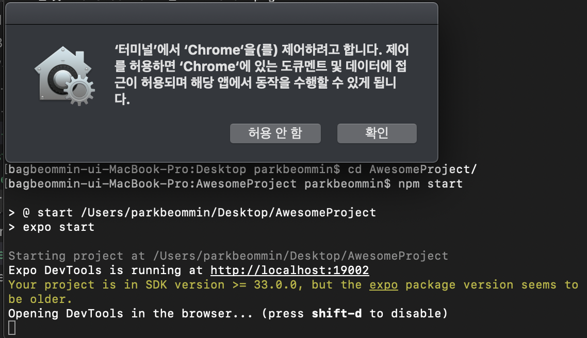

에러가 나서 안될줄 알았더니, 위와 같은 화면이 뜹니다.  
19002번 포트로 뭔가 실행이 되고 크롬브라우저를 통해 뭔가 보여주려는 것 같습니다.  
확인을 눌러주고 브라우저에서 19002번 포트로 접속합니다.  

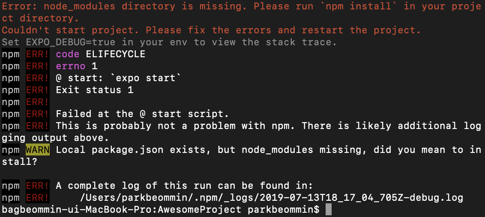

뭔가 뜨는가 싶더니.. 프로젝트를 실행할 수 없다는 에러 메시지가 뜹니다..  

당황하긴 했지만.. 퍼미션 에러였으니까 프로젝트 생성할 때 sudo를 붙여주면 어떨까 생각을 했습니다.  
test라는 프로젝트를 생성해보겠습니다.  
~~~
sudo expo init test
~~~

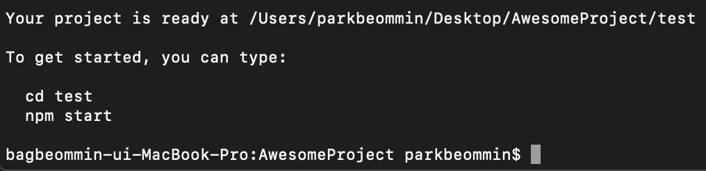

역시나.. 성공적으로 생성이 되었습니다.  
다시 실행해보도록 하겠습니다.  

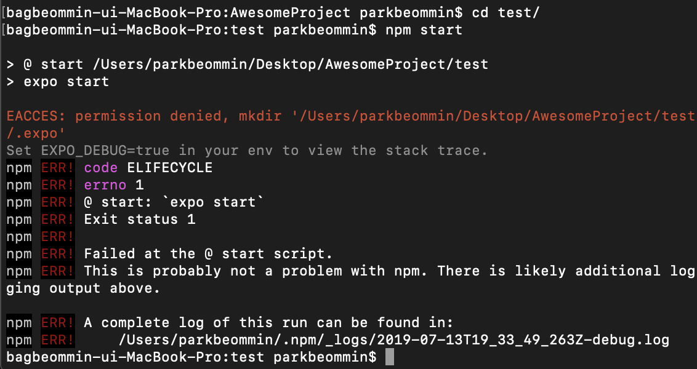

당연히 잘 될 줄 알았는데.. 또 퍼미션 에러입니다..  
실행할때도 sudo를 붙여주도록 하겠습니다.  

~~~
sudo npm start
~~~

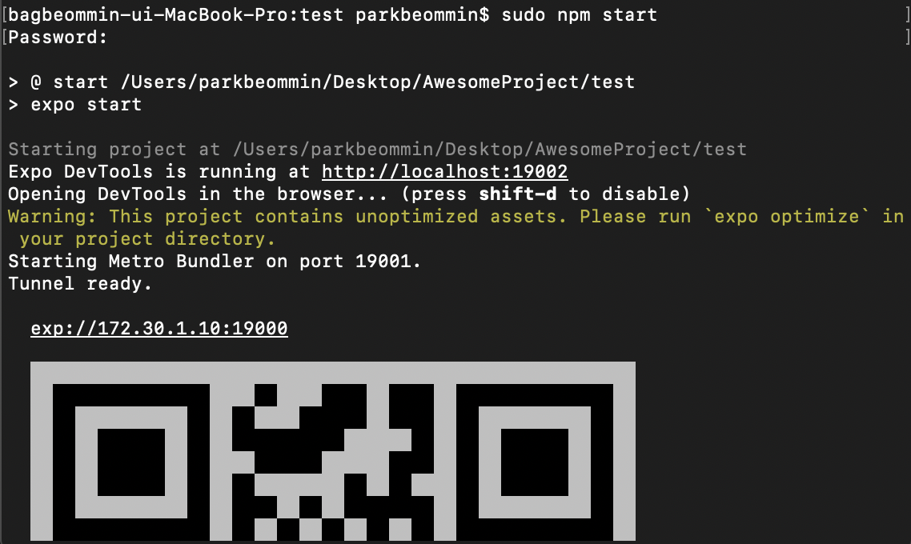

역시 성공적으로 실행이 되었습니다.  
QR코드도 뜨고 IP주소도 보입니다.  
그리고 웹 브라우저에도 화면이 나타납니다.  

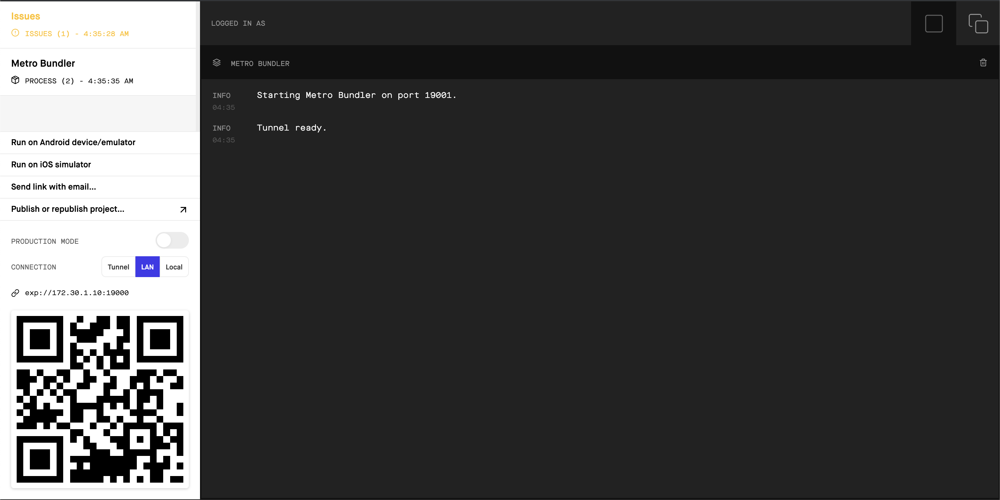

뭔가 프로젝트를 관리할 수 있는 대쉬보드 같은 모습입니다.  
문서를 보니 개발 서버라고 합니다.  
QR코드나 IP주소를 보니 뭔가 모바일로 접속을 해봐야할 것 같습니다.  

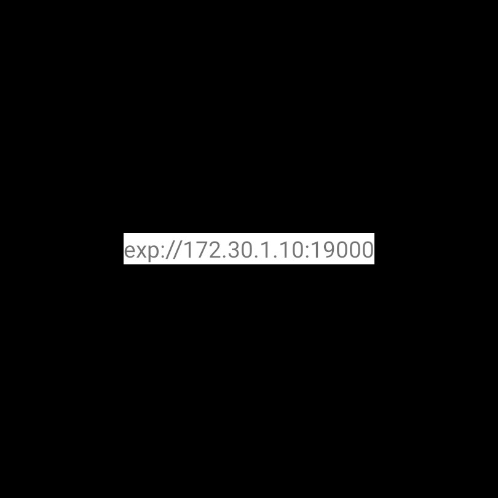

빅스비 비전으로 QR코드를 인식하는 이렇게 나왔습니다.  
모바일 화면이 나올거라 기대했는데, IP주소가 나왔습니다.  
IP주소로 접속해보라는 거겠죠..?  

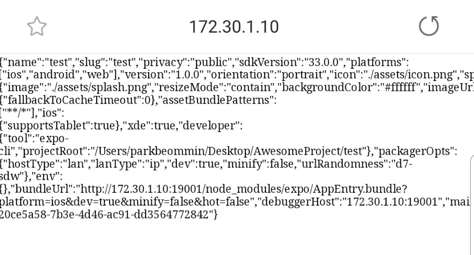

... 무엇이 잘못된걸까요..  
모바일 화면이 나올거란 기대는 절대 하지말라는 의미인것 같습니다.  

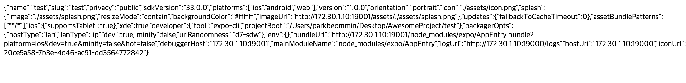

혹시나 해서 웹 브라우저에서도 접속해봤지만, 똑같습니다.  

문서로 돌아가서 다음 진행을 보도록 하겠습니다.  
QR코드를 인식하는 것은 맞았지만, Expo 앱을 설치하라고 합니다.  

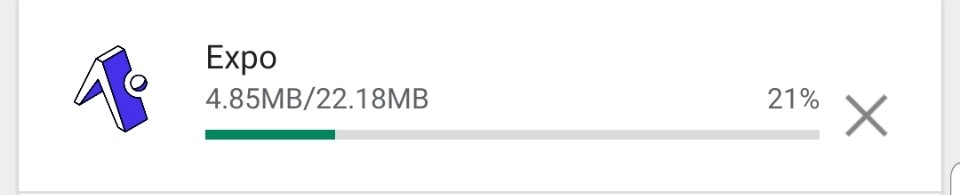

플레이스토어에 가서 다운받습니다.  
그리고 노트북과 같은 네트워크 상에 있어야합니다.  

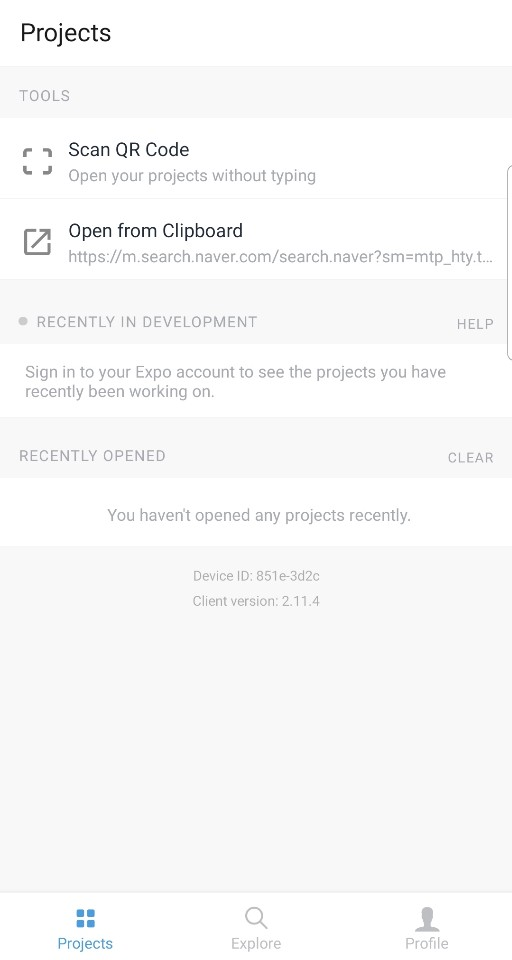

Expo앱을 실행시키니 위와 같이 Scan QR Code 기능이 있습니다.  
바로 QR코드를 인식시켜줍니다.  

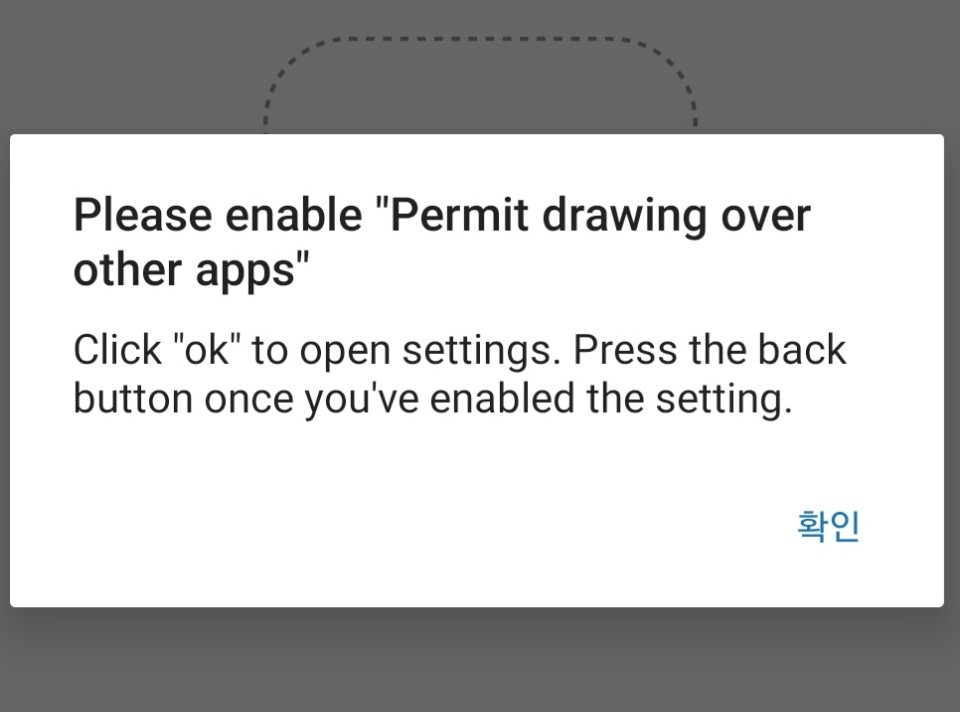

이번에는 정말 실행이 되려합니다.  
다른 앱 위에 그려지는 권한을 허용해달라고 하니 확인을 눌러주고 허용해줍니다.  

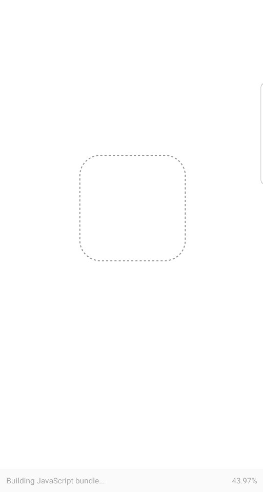

하단에 뭔가 진행이 되고 있습니다.  
자바스크립트 번들을 만들고 있습니다.  

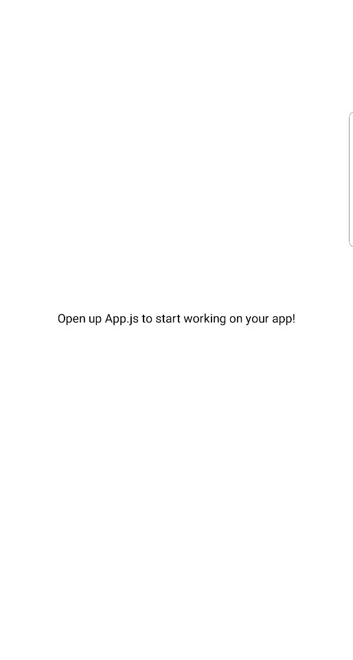

드디어 실행이 되었습니다!  
아마 템플릿이 blank로 되어있어서 이렇게 출력이 되는 것 같습니다.  

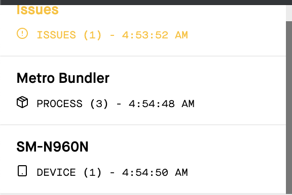

아까 웹 브라우저에 대쉬보드 같은 곳에 기기가 연결되었다는 것이 표시됩니다.  

이제 출력된 내용을 바꿔보도록 하겠습니다.  

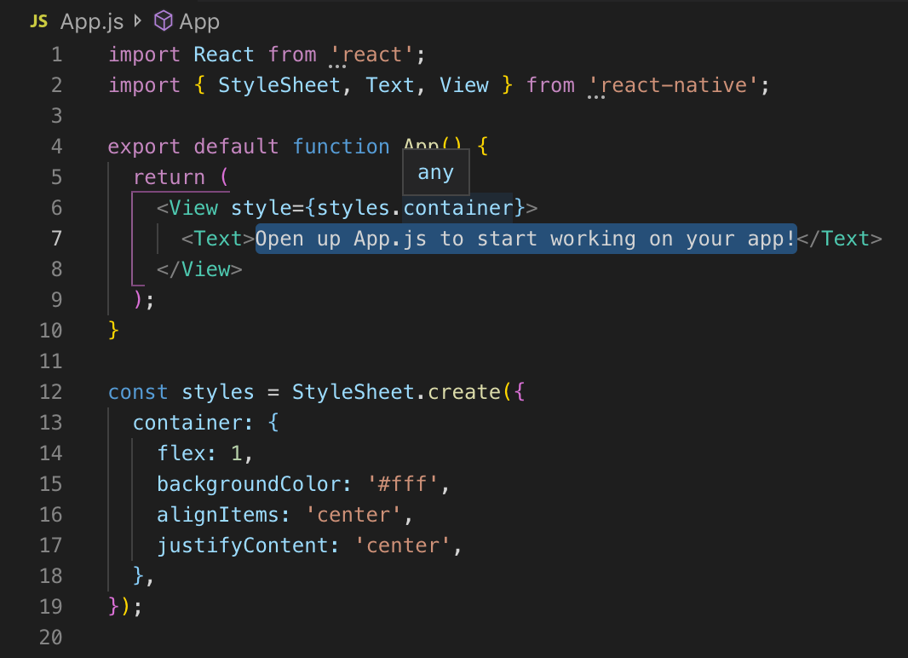

App.js 파일을 열어보니, 출력되었던 텍스트가 보입니다.  

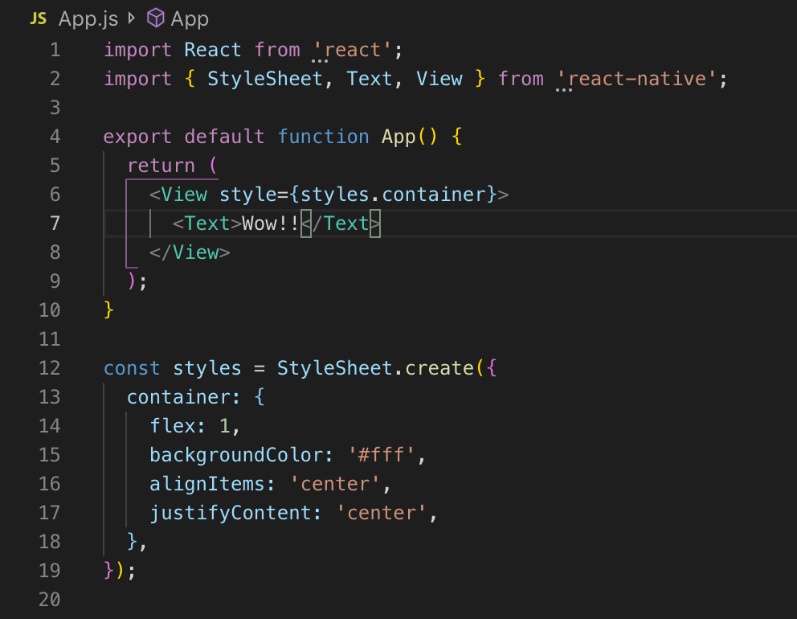

이 부분을 바꿔줍니다.  

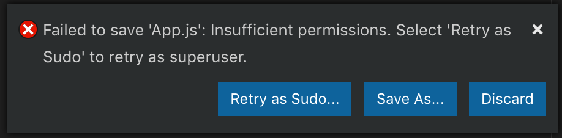

그런데 또.. 퍼미션이 필요하다고 합니다.. 변경된 파일을 저장하는데도 sudo권한이 필요하답니다..  
이건 뭔가 문제가 있는 것 같으니, 수정된 텍스트를 확인 후 알아보도록 하겠습니다.  

저장을 하고 확인을 해보니, 아무 변화가 없습니다..  
문서에서는 수정을 하고 어플리케이션을 리로드하면 바뀐다고 해서 리로드 버튼을 찾아보니 상태바에 있었습니다.  

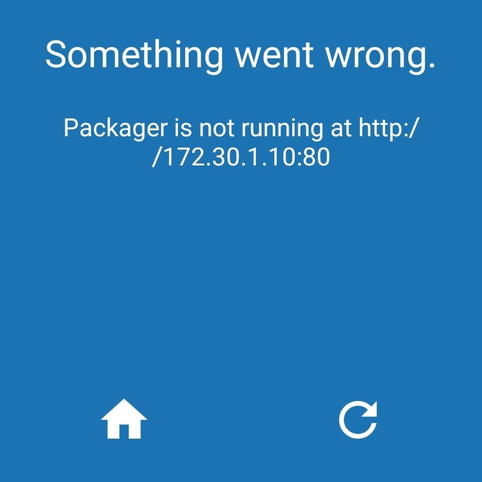

한 번에 되는 법이 없습니다..  
뭔가 또 문제가 발생했습니다.  

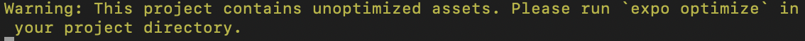

리로드 버튼을 누를때마다 터미널창에 위와 같은 워닝이 뜹니다.  
아래와 같은 명령어를 실행시켜 달라는 것 같습니다.  
혹시나 해서.. 실행중이 expo 개발 서버를 종료시키고 다시 실행해서 해보니 아주 잘됩니다..  
리로드 버튼을 눌러줄 필요도 없이 수정하고 저장하면 바로 앱에서 변경이 됩니다.  

정말 이 간단한 개발 환경 셋팅에서도 삽질을 여러 번 했네요.. 'ㅁ';

감사합니다.

## 레퍼런스

[React Native 공식 문서][docs-url]
[Node Update][ref-url-1]

[last-posting]: "https://parkbeommin.github.io/react-native/react-native-start/"
[docs-url]: "https://facebook.github.io/react-native/docs/getting-started"
[ref-url-1]: "https://velopert.com/1351"